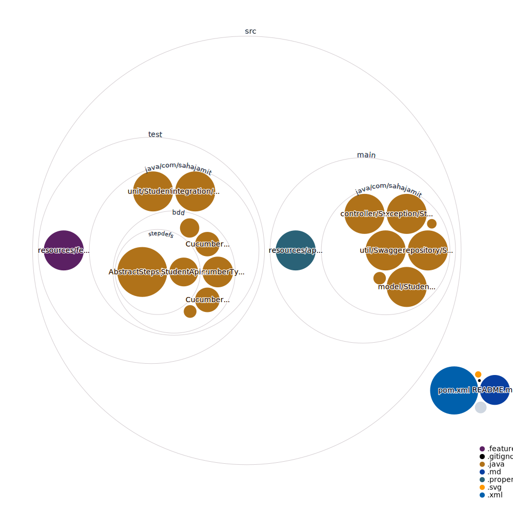

### Student Enrollment Sample Rest API

[](https://octo-repo-visualization.vercel.app/?repo=sahajamit%2student-sample-api) 
[View interactive Diagram](https://octo-repo-visualization.vercel.app/?repo=sahajamit%2Fstudent-sample-api)

I have developed this REST API in 2019 as a part of coding assignment for one of the Fintech firm in Singapore. 

I have decided to opensource it now.

The ask was:

* To build a simple REST API which should support CRUD operations like GET, POST, PUT, PATCH and DELETE on a student database.
* MySQL DB should be used to store the student details.
* It should also support H2 in-memory DB for unit testing.
* The solution should use Spring JPA (Java Persistence API) and Hibernate to abstract the database related operations.
* To have some basic unit tests using Mockito
* Integration tests against the H2 database
* Write some Cucumber E2E tests to verify the CRUD operations are working fine.
* The whole solution should be Containerized and can be started using docker.
* CI/CD Pipeline using Jenkins (now changed to Github Actions) where all the unit, integration and cucumber acceptance tests should be executed,
before deploying the docker image to Docker hub.
* The API documentation should be accessible using Swagger URL.
 

#### To run the application

##### Using Docker:

```
docker run sahajamit/student-enrollment-api
```

##### Locally:
```
 mvn spring-boot:run
```
The application will run on the port 8081 by default.

#### To explore the API, the swagger documentation for this api can be seen using this [url](http://localhost:8080/swagger-ui.html)

```
http://localhost:8081/swagger-ui.html
```

#### To run all the unit tests

```
 mvn -q test -Dtest=StudentApiUnitTests
```

#### To run all the integration tests

```
 mvn -q test -Dtest=StudentApiIntegrationTests
```

#### To run all the cucumber tests

```
 mvn -q test -Dtest=RunCucumberTest
```

#### Cucumber Tests HTML Report will be generated in this directory

```
/target/html-reports/cucumber-html-reports/overview-features.html
```

#### All the unit and integration tests report will be generated in this directory

```
/target/surefire-reports
```

#### The complete CI/CD pipeline can be seen in the Github actions tab.
